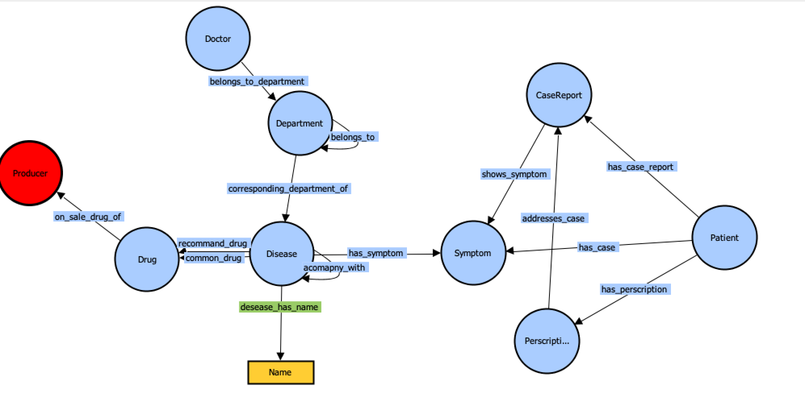

# XM: 基于知识图谱的处方校验系统

医生输入：症状、诊断、处方（药品）

处理：将“症状、诊断”与处方中的药品在系统里存储的（说明书或厂商提供的）描述的适应症状进行匹配

输出：匹配程度或比较结果明细

## 知识图谱schema设计


```
 1. 根据系统主要功能，细化处方、症状部分。考虑实体是症状 和疾病种类。反而是科室之类的在第一个步骤中可能不是最关心的部分。
 2. 明确为用户和功能，不要做旁支的东西。
```


[参考资源](https://github.com/liuhuanyong/QASystemOnMedicalKG) ： 基于知识图谱的医药问答系统

## 外部数据源

1. 暂时使用[药智数据/临床合理用药数据库](https://db.yaozh.com/clinicaldrug?name=&yaoli=&zhuzhi=%E5%8F%91%E7%83%AD&xianghuzuoyong=&yaodong=&first=%E5%85%A8%E9%83%A8)作为外部数据源替代说明书或厂商提供的适应症状描述

2. [爬虫](./crawler/crawler)
